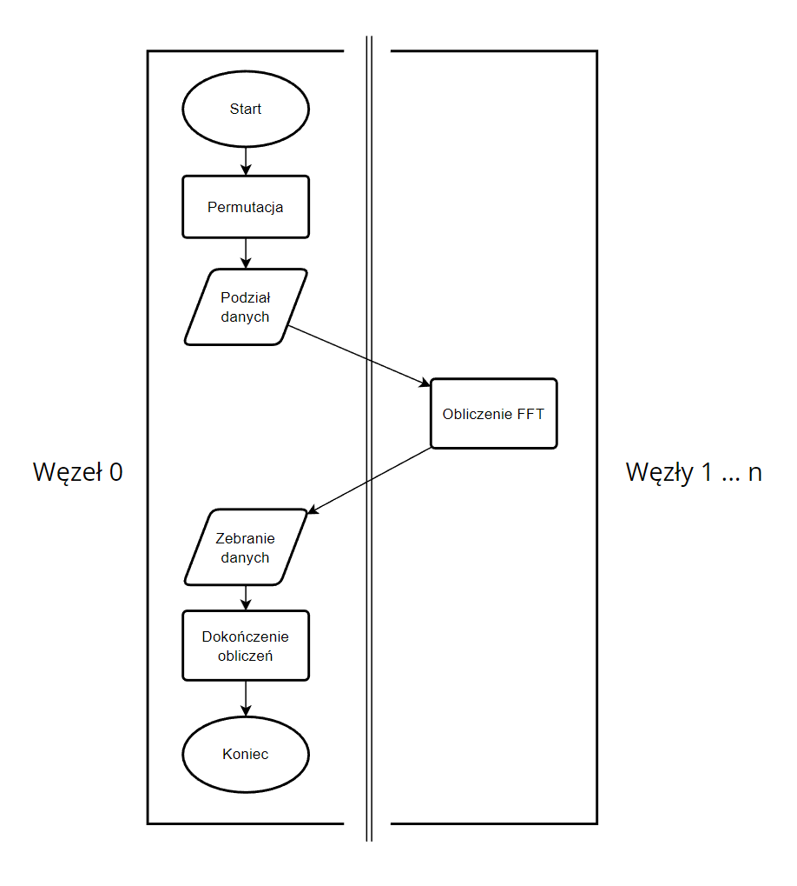

# SRiR - Szybka transformata Fouriera FFT
Projekt wykonany w ramach zajęć "Systemy Równoległe i Rozproszone", WFiIS AGH 2023. Autorzy:

 - Michał Orlewski
 - Kacper Osuch
## Założenia projektu
Celem projektu było wykonanie programu do obliczania szybkiej transformaty Fouriera (FFT) w sposób równoległy z wykorzystaniem biblioteki MPI.
## Zawartość projektu
 - Kod źródłowy - `fft.c`
 - Plik `Makefile`
 - Przykładowe dane wejściowe - `data/data.txt`
 - Przykładowe dane wyjściowe - `example_output/output.txt`
 - Folder na dane wyjściowe - `output/`
 - Dokumentacja - `README.md` oraz `README.pdf`

## Funkcjonalności makefile
Przed kompilacją i uruchomieniem programu należy wykonać polecenie `source /opt/nfs/config/source_mpich401.sh` aby wczytać potrzebne zmienne środowiskowe. Domyślnie program wywoływany jest na 8 węzłach. Ze względu na wykorzystany algorytm liczba węzłów musi być potęgą liczby 2.
 - Kompilacja i uruchomienie - `make`
 - Przywrócenie katalogu do stanu początkowego - `make clean`
 - Tylko kompilacja - `make fft`
 - Tylko uruchomienie - `make run`

## Interfejs
Zaimplementowany został prosty interfejs użytkownika, który umożliwia wybranie danych wejściowych i uruchomienie algorytmów. Użytkownik ma możliwość użycia przykładowego pliku (Opcja 1.) lub wybranie własnego poprzez wpisanie ścieżki (Opcja 2.). Istnieje również możliwość wyjścia z programu (Opcja 9.).

## Struktura plików wejściowych i wejściowych

Plik wejściowy zawiera:
 - Pierwsza linia - Liczba punktów N. Powinna być potęgą liczby 2. Jeśli nią nie jest, zostanie podniesiona do najbliższej potęgi dwójki.
 - Pozostałe linie - liczby zespolone w formacie `re im`

Plik wyjściowy zawiera:
 - Pierwsza linia - Wykorzystana liczba N.
 - Pozostałe linie - Obliczone punkty

## Schemat działania programu

 - Inicjalizacja MPI
 - Wyświetlenie interfejsu, ustalenie nazwy pliku, wczytanie i wstępne przygotowanie danych wejściowych - węzeł 0
 - Uruchomienie szeregowego algorytmu FFT na węźle 0.
 - Uruchomienie równoległego algorytmu FFT z wykorzystaniem wszystkich węzłów.
 - Wyświetlenie wyników
 - Zakończenie pracy MPI

## Opis działania równoległego algorytmu FFT

 - Węzeł 0 dokonuje permutacji elementów poprzez odwracanie bitów w indeksach tablicowych
 - Węzeł 0 rozdziela dane pomiędzy wszystkie procesy
 - Każdy węzeł wykonuje pierwszą część obliczeń FFT na swoich lokalnych danych za pomocą algorytmu szeregowego z pominięciem permutacji (log2(N)-log2(p) iteracji pętli)
 - Wyniki zostają zebrane do węzła 0
 - Węzeł 0 dokańcza obliczenia (ostatnie log2(p) iteracji)

### Schemat:

