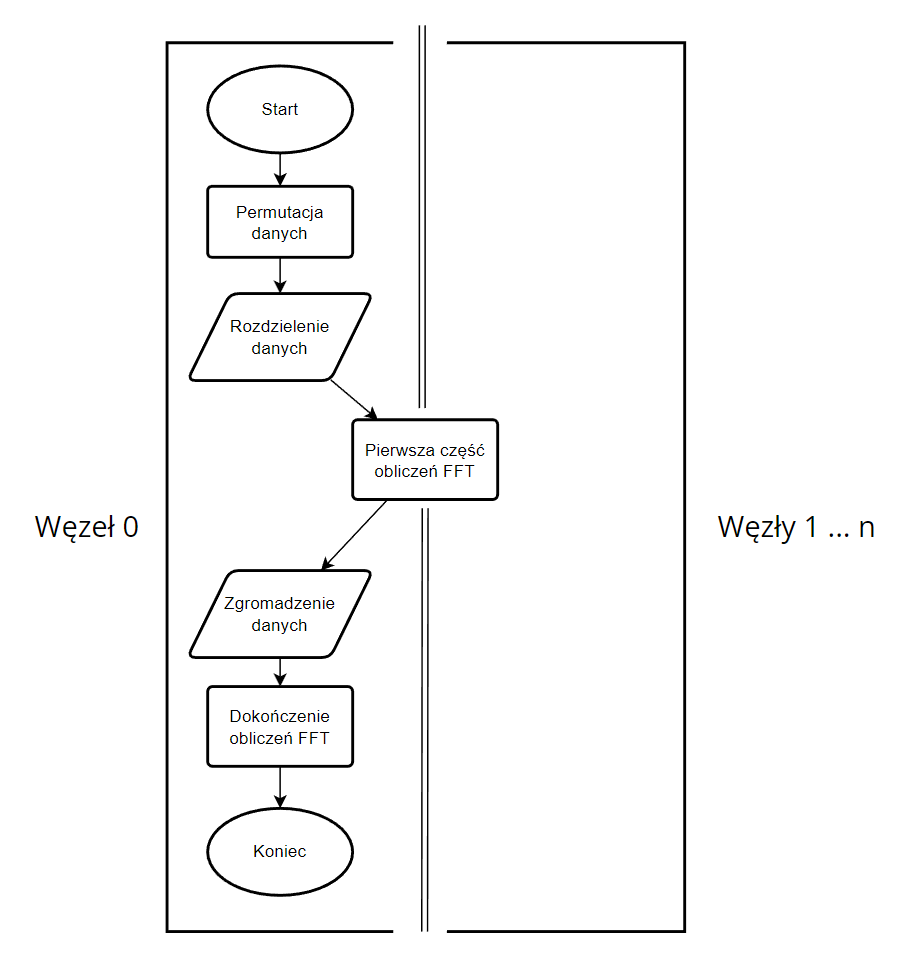

# SRiR - Szybka transformata Fouriera FFT
Projekt wykonany w ramach zajęć "Systemy Równoległe i Rozproszone", WFiIS AGH 2023. Autorzy:

 - Michał Orlewski
 - Kacper Osuch
## Założenia projektu
Celem projektu było wykonanie programu do obliczania szybkiej transformaty Fouriera (FFT) w sposób równoległy z wykorzystaniem biblioteki UPC++ i .
## Zawartość projektu
 - Kod źródłowy - `fft.cpp`
 - Plik `Makefile`
 - Przykładowe dane wejściowe - `data/data.txt`
 - Przykładowe dane wyjściowe (dla N=8) - `example_output/output.txt`
 - Folder na dane wyjściowe - `output/`
 - Dokumentacja - `README.md` oraz `README.pdf`

## Funkcjonalności makefile
Przed kompilacją i uruchomieniem programu należy wykonać polecenie `source /opt/nfs/config/source_upcxx_2023.3.sh` aby wczytać potrzebne zmienne środowiskowe. Domyślnie program wywoływany jest na 8 węzłach. Ze względu na wykorzystany algorytm liczba węzłów musi być potęgą liczby 2 oraz liczba danych wejściowych musi być podzielna przez liczbę węzłów.
 - Kompilacja i uruchomienie - `make`
 - Przywrócenie katalogu do stanu początkowego - `make clean`
 - Tylko kompilacja - `make fft`
 - Tylko uruchomienie - `make run`

## Struktura plików wejściowych i wejściowych

Plik wejściowy zawiera:
 - liczby zespolone w formacie `re im`

Plik wyjściowy zawiera:
 - Obliczone punkty - liczby zespolone w formacie `re im`

## Schemat działania programu

 - Inicjalizacja UPC++
 - Wczytanie i wstępne przygotowanie danych wejściowych - węzeł 0
 - Uruchomienie równoległego algorytmu FFT z wykorzystaniem wszystkich węzłów.
 - Zapisanie wyników do pliku - węzeł 0
 - Zakończenie pracy UPC++

## Opis działania równoległego algorytmu FFT

 - Węzeł 0 dokonuje permutacji elementów poprzez odwracanie bitów w indeksach tablicowych
 - Węzeł 0 alokuje dane w globalnej przestrzeni adresowej
 - Węzły inicjują wskaźniki do swoich części danych (partycja blokowa)
 - Każdy węzeł wykonuje pierwszą część obliczeń FFT na swoich lokalnych danych za pomocą algorytmu szeregowego (log2(N)-log2(p) iteracji pętli)
 - Węzeł 0 dokańcza obliczenia (ostatnie log2(p) iteracji)

### Schemat:

